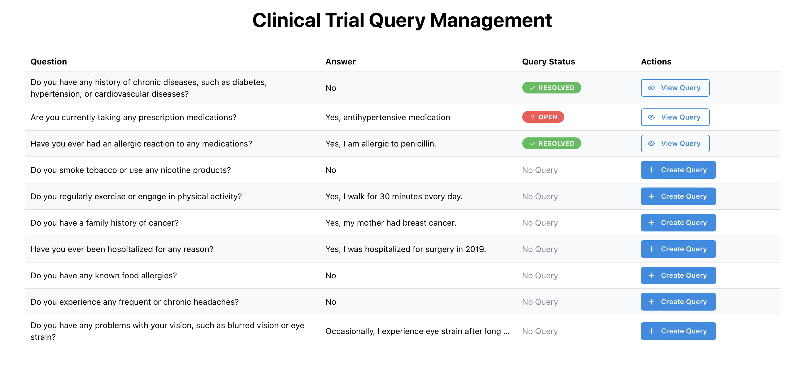

# Vial Query Management Application

This GitHub repository contains the code for the Vial take-home assignment - a Query Management Application for clinical trials data quality management.

## Features

The application is designed with the following key features:

**Backend API**:
- RESTful API built with Node.js, TypeScript, and Fastify
- PostgreSQL database with Prisma ORM
- Complete CRUD operations for queries
- Form data integration with query relationships

**Frontend Dashboard**:
- React/Next.js application with TypeScript
- Mantine UI components for modern interface
- Data table displaying form data with query status
- Create Query modal for new query creation
- View/Edit Query modals for existing queries
- Status indicators (OPEN/RESOLVED) with color coding

**Query Management**:
- Create queries linked to form data entries
- Update query status (OPEN → RESOLVED)
- View query details and descriptions
- Delete queries (bonus feature)
- Prevent duplicate queries per form data entry


## Getting Started

1. **Clone the Repository**:
```bash
   git clone https://github.com/omarhmoursy/vial-tha.git
   cd vial-tha
   ```

2. **Environment Setup**:
   ```bash
   cp .env.example .env
   ```

3. **Start Backend with Docker** (this includes PostgreSQL database):
   ```bash
   docker-compose build
   docker-compose up
   ```
   *Note: The backend API will automatically start on http://localhost:8080*

4. **Database Setup** (in a new terminal):
   ```bash
   npm run migrate
   npm run seed
   ```

5. **Start Frontend** (in a new terminal):
   ```bash
   cd frontend
   npm install
   npm run dev
   ```

6. **Access the Application**:
   - Frontend: http://localhost:3000
   - Backend API: http://localhost:8080

## API Endpoints

- `GET /form-data` - Retrieve all form data with query relationships
- `POST /queries` - Create a new query
- `PUT /queries/:id` - Update query status or description
- `DELETE /queries/:id` - Delete a query

## Tech Stack

- **Backend**: Node.js, TypeScript, Fastify, Prisma ORM, PostgreSQL
- **Frontend**: Next.js 15, React, TypeScript, Mantine UI
- **Infrastructure**: Docker, Docker Compose

## Screenshot of the application:




